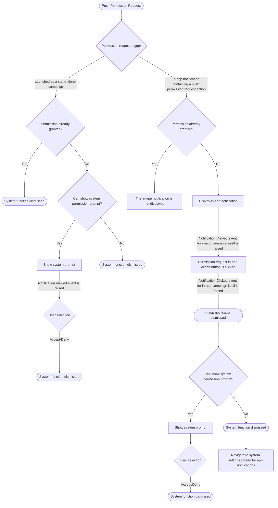
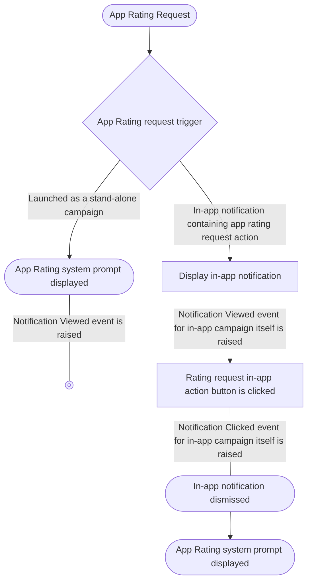

# System In-App Functions
CleverTap iOS SDK 7.2.0+ supports a set of built-in in-app functions. They can be assigned to in-app notification button actions or can be used as stand-alone campaigns. To learn more about them see the CleverTap documentation.

## Open URL
This function will open url or deeplink for `iOS` URL configured through the CleverTap Dashboard while selecting function as stand-alone in-app template. `Notification Viewed` event is raised for valid URL.

## Push Permission
This function starts the push permission request flow. Here is a summary of the flow and its results:

## App Rating
This function displays the system app rating dialog. Here is a summary of the flow and its results:
